# Experiment5

در این آزمایش با استفاده از ابزار YourKit مقدار مصرف توابع مختلف را نظاره می‌کنیم.

## پروفایل کردن MainSource

تصویر زیر مصرف cpu قبل شروع برنامه MainSource را نشان می‌دهد.

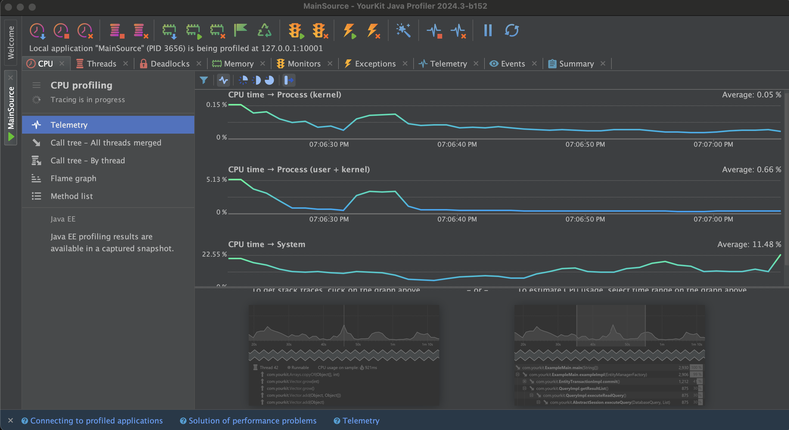

این تصویر زمانی‌ است که برنامه شروع به اجرا کرده است.

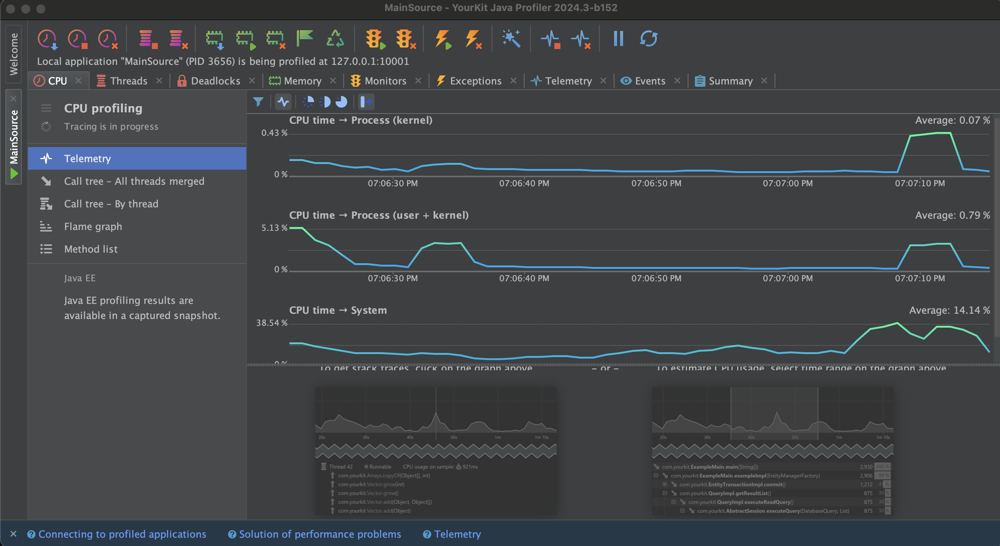

و در نهایت در این تصویر مشخص است که تابع A.doJobA بیشترین مصرف cpu را داشته است.

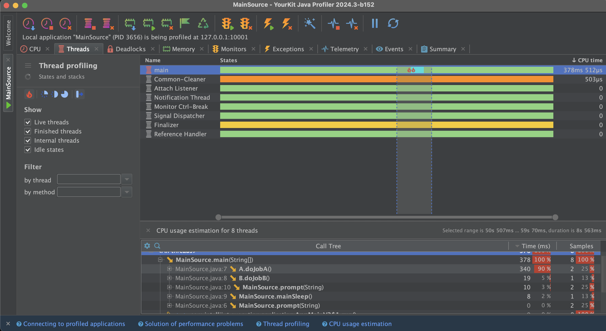

## پروفایل کردن JavaCup

در این تصویر شرایط قبل از وارد کردن عدد ۳ مشخص است.

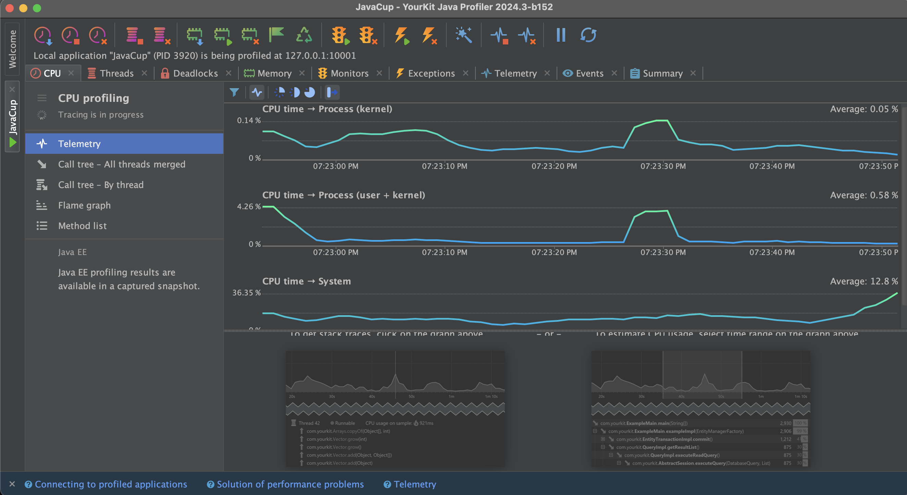

در تصویر زیر نیز بعد از وارد کردن عدد ۳ و شروع تابع temp وضعیت cpu مشخص است.

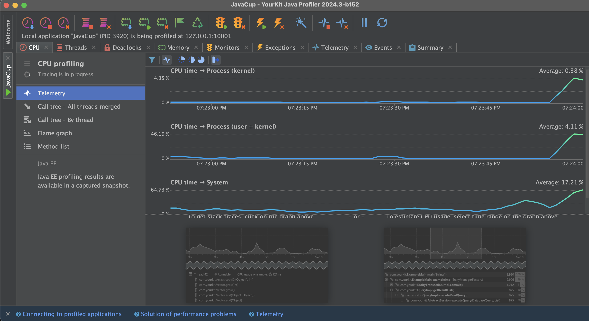

در نهایت در این تصویر مشخص شده است که تابع temp تقریبا ۹۹ درصد سهم اجرا را گرفته است.

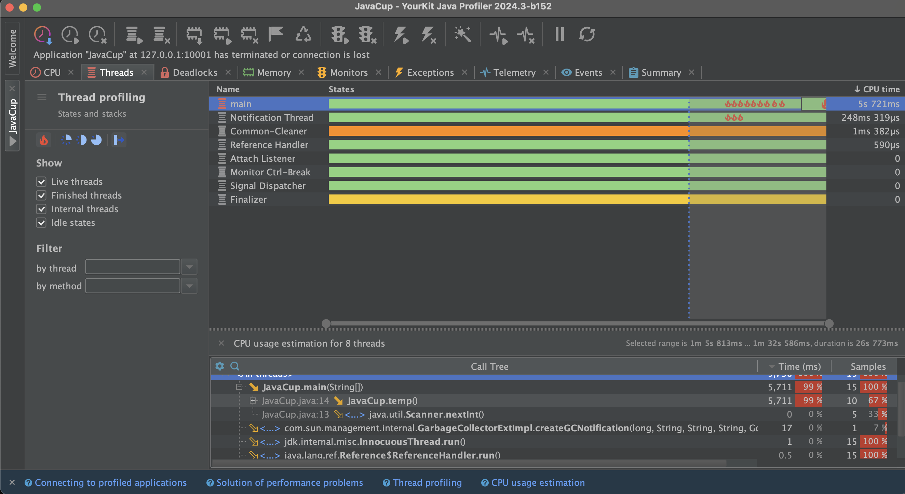

# بخش ۱

در این بخش با تغییر کد تعداد for loop هایی که میزنیم را بدون تغییر کارکرد برنامه کم کردیم. در تصویر زیر مشخص است که در برنامه بعد از تغییر دیگر تابع temp درصدی از cpu را مصرف نمی‌کند.

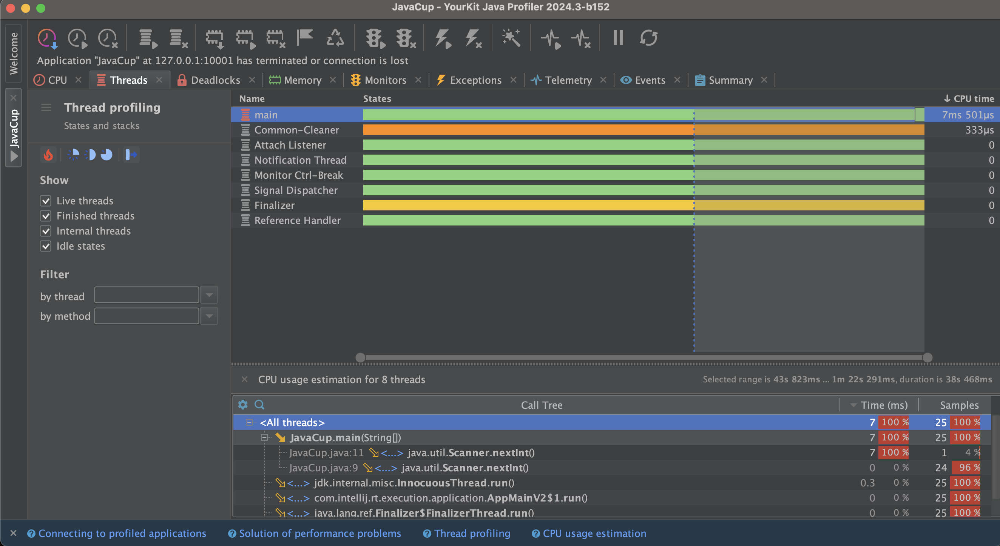

# بخش ۲

## توضیحات درباره پروژه

در این بخش ما برنامه‌ی MainSource را طوری تغییر دادیم که در A عملیات contains (که وجود یک عضو در آرایه یا مپینگ را چک می‌کند) روی ArrayList و در B که بهبود یافته‌ی A خواهد بود، این عملیات روی HashSet انجام می‌شود. در ادامه به مقایسه این دو خواهیم پرداخت.

دقت کنید که هر کدام از A و B یک تابع ساخت Array و HashSet دارند و یک تابع پیدا کردن تعدادی عضو به نام contains که روی تعداد نسبتا زیادی ورودی تابع .contains را صدا می‌زند.

## اجرای A

در تصویر زیر پروفایلینگ زمانی که فقط A اجرا می‌شود مشخص شده است.

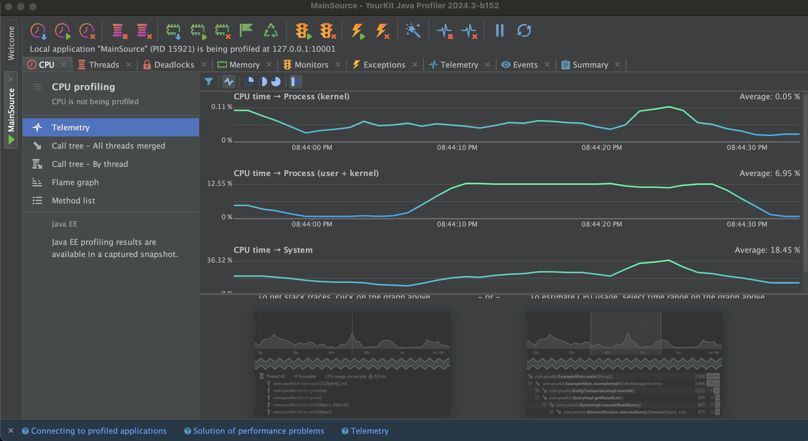
 
همینطور تصویر زیر نشان‌دهنده‌ی درصد مصرف زمانی که فقط A اجرا شود.

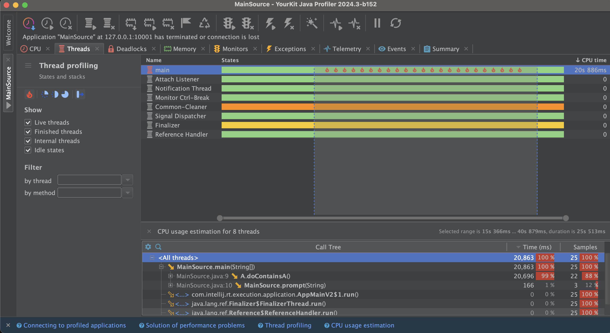

## اجرای همزمان A و ‌B

در این تصویر وضعیت سیستم زمانی که هر دو با هم اجرا شوند مشخص است. (برای مشخص شدن containsB تعداد ورودی‌های آن را بیشتر دادیم تا محو نشود.)

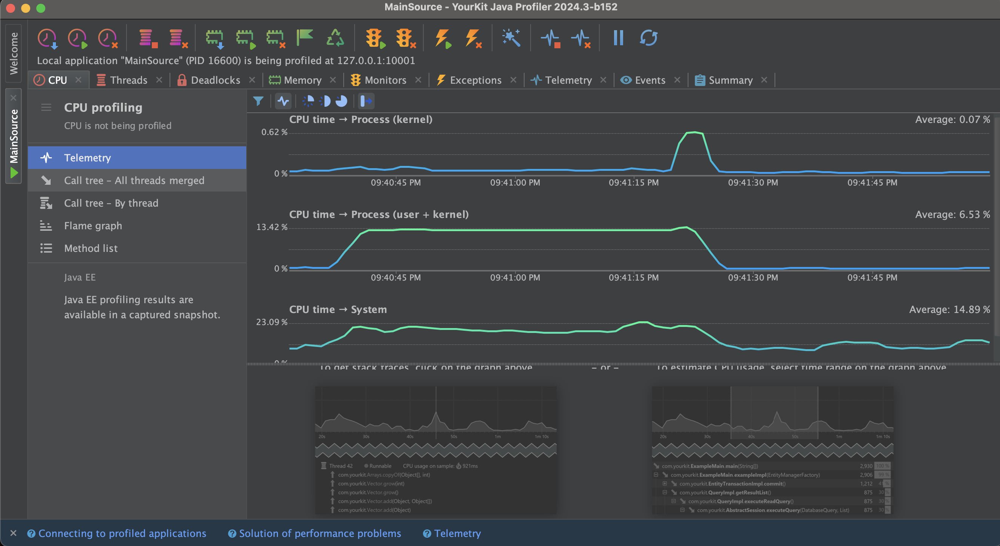

همانطور که در این تصویر واضح است با اینکه تعداد ورودی‌های B بیشتر است ولی با انجام دقیقا همان کار عملکرد بسیاااار بهتری نشان می‌دهد.

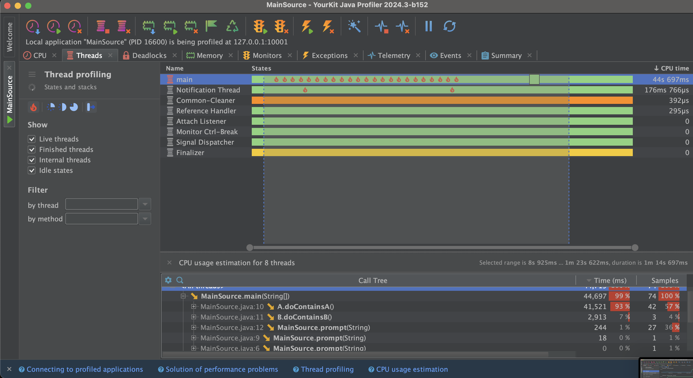
